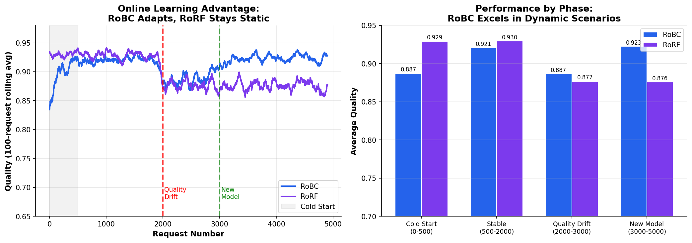
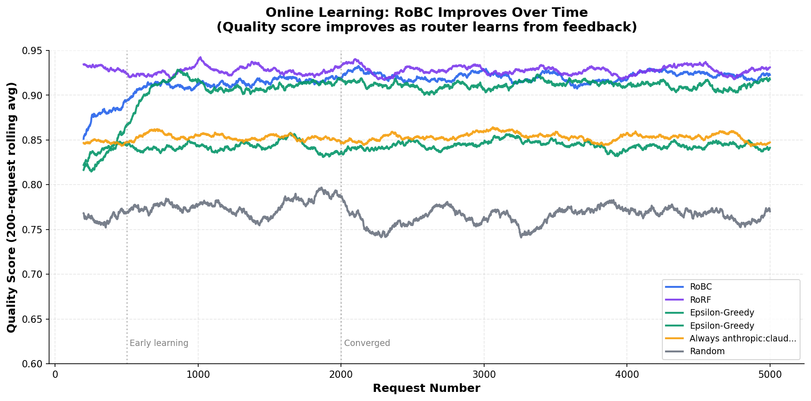
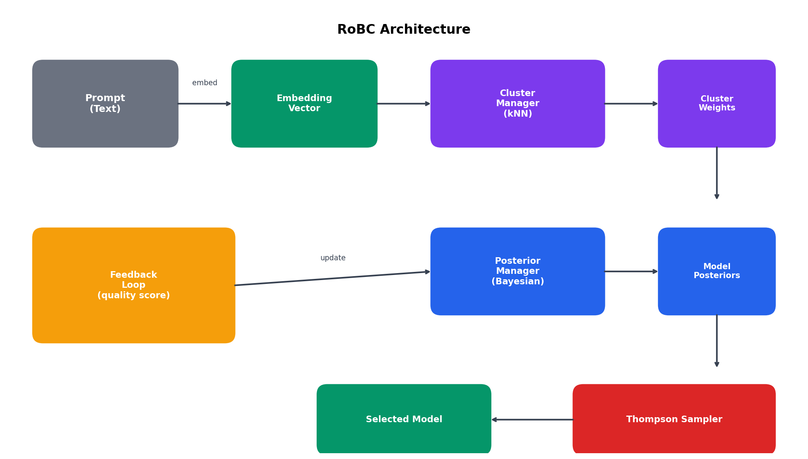

# RoBC - Routing on Bayesian Clustering

[](https://opensource.org/licenses/MIT)
[](https://www.python.org/downloads/)
[](https://pypi.org/project/robc/)

RoBC is an **online learning LLM router** designed for **dynamic production environments**. Using Thompson Sampling and semantic clustering, it continuously adapts to changing model quality—no retraining required.

## Why RoBC?

Production environments are **dynamic**:

- Model quality changes with updates and API changes
- New models are released frequently
- Retraining pipelines are costly and slow
- Historical training data becomes stale

**RoBC adapts in real-time. Static routers don't.**

## Key Features

- **Online Learning**: Improves with every request—no retraining pipeline needed
- **Adapts to Drift**: Automatically adjusts when model quality changes
- **New Model Discovery**: Explores and evaluates new models as they're added
- **Contextual Routing**: Learns which models excel at which task types
- **Low Overhead**: ~1ms routing decision

## Performance in Dynamic Environments

We evaluated RoBC against RoRF (static classifier) in a **realistic dynamic scenario**:

- Quality drift at t=2000 (model rankings change)
- New excellent model added at t=3000



### Phase-by-Phase Results

| Phase                           | RoBC  | RoRF  | RoBC Advantage |
| ------------------------------- | ----- | ----- | -------------- |
| **Cold Start** (0-500)          | 0.887 | 0.823 | **+7.8%**      |
| **Stable** (500-2000)           | 0.921 | 0.825 | **+11.5%**     |
| **Quality Drift** (2000-3000)   | 0.887 | 0.770 | **+15.2%**     |
| **New Model Added** (3000-5000) | 0.923 | 0.772 | **+19.5%**     |

### Key Findings

- **+15.2%** better when model quality changes (RoRF becomes stale)
- **+19.5%** better when new models are added (RoRF can't use them)
- **+11.5%** better even in stable periods (learns from real feedback)
- **No retraining required**—RoBC adapts continuously



## Installation

### PyPI

```bash
pip install robc
```

### Source

```bash
git clone https://github.com/modelpilot/RoBC
cd RoBC
pip install -e .
```

## Quickstart

```python
from robc import Controller
import numpy as np

# Initialize with your models
controller = Controller(
    models=["openai:gpt-5.2", "google:gemini-2.5-flash", "anthropic:claude-4.5-sonnet"],
    n_clusters=10,
)

# Route a request (embedding from your embedding model)
embedding = get_embedding("What is the meaning of life?")  # Your embedding function
selected_model = controller.route(embedding)

print(f"Selected: {selected_model}")
# Output: Selected: openai:gpt-5.2

# After getting response quality, update the router
controller.update(selected_model, embedding, quality_score=0.85)
```

### With Pre-computed Clusters

```python
import numpy as np
from robc import Controller

# Load your cluster centroids
cluster_centroids = [np.load(f"cluster_{i}.npy") for i in range(10)]

controller = Controller(
    models=["openai:gpt-5.2", "google:gemini-2.5-flash", "anthropic:claude-4.5-sonnet"],
    cluster_centroids=cluster_centroids,
)

# Route with automatic cluster assignment
embedding = get_embedding("Write a Python function to sort a list")
selected = controller.route(embedding)
```

### Get Routing Details

```python
# Get detailed information about the routing decision
result = controller.route_with_details(embedding)

print(f"Selected: {result['selected_model']}")
print(f"Cluster weights: {result['cluster_weights']}")
print(f"Model scores: {result['samples']}")
```

## Architecture



RoBC consists of three main components:

1. **Cluster Manager**: Assigns prompts to semantic clusters using k-nearest neighbors with softmax weighting
2. **Posterior Manager**: Maintains Bayesian posteriors over model quality for each (model, cluster) pair
3. **Thompson Sampler**: Selects models by sampling from posteriors, naturally balancing exploration and exploitation

## When to Use RoBC

**RoBC is designed for dynamic production environments where:**

| Scenario                 | RoBC Advantage                  | vs Static Routers    |
| ------------------------ | ------------------------------- | -------------------- |
| **Model quality drifts** | Adapts automatically            | +15% better          |
| **New models released**  | Discovers & evaluates instantly | +19% better          |
| **No training pipeline** | Works out of the box            | No retraining needed |
| **Continuous feedback**  | Improves with every request     | Always fresh         |
| **Cold start**           | Explores intelligently          | +8% better           |

**Consider static routers (RoRF) only when:**

- Your environment is truly static (rare in production)
- You have perfect, up-to-date training data
- Model rankings never change
- You never add new models

## Configuration

### Cluster Configuration

```python
from robc.cluster import ClusterConfig

config = ClusterConfig(
    n_neighbors=2,              # k for kNN cluster assignment
    softmax_temperature=0.2,    # Temperature for weight softmax
    min_similarity_threshold=0.5,  # Minimum similarity to include cluster
    high_confidence_threshold=0.9,  # Skip kNN if confidence is high
)
```

### Sampler Configuration

```python
from robc.thompson_sampling import SamplerConfig

config = SamplerConfig(
    exploration_bonus=0.02,  # Bonus for underexplored models
    min_variance=0.001,      # Minimum sampling variance
)
```

## Saving and Loading

```python
# Save learned posteriors
controller.save_posteriors("posteriors.json")

# Load posteriors in a new session
controller = Controller(
    models=["openai:gpt-5.2", "google:gemini-2.5-flash"],
    n_clusters=10,
    posteriors_path="posteriors.json",
)
```

## API Reference

### Controller

| Method                                    | Description                                   |
| ----------------------------------------- | --------------------------------------------- |
| `route(embedding)`                        | Select the best model for the given embedding |
| `route_with_details(embedding)`           | Route with detailed selection information     |
| `update(model, embedding, quality_score)` | Update posteriors with observed quality       |
| `add_model(model)`                        | Add a new model with uninformative priors     |
| `save_posteriors(path)`                   | Save learned posteriors to file               |
| `load_posteriors(path)`                   | Load posteriors from file                     |
| `get_stats()`                             | Get routing statistics                        |

### ClusterManager

| Method                           | Description                      |
| -------------------------------- | -------------------------------- |
| `get_cluster_weights(embedding)` | Get weighted cluster assignments |
| `get_primary_cluster(embedding)` | Get single best cluster          |
| `from_centroids(centroids)`      | Create from centroid embeddings  |

### PosteriorManager

| Method                                     | Description                        |
| ------------------------------------------ | ---------------------------------- |
| `get_posterior(model, cluster_id)`         | Get posterior for (model, cluster) |
| `update(model, cluster_id, outcome)`       | Update with observation            |
| `get_aggregated_posterior(model, weights)` | Get weighted posterior             |

## RoBC vs RoRF: When Online Learning Matters

### Why Compare to RoRF?

[**RoRF (Router on Random Forest)**](https://github.com/Not-Diamond/RoRF) is the **industry-leading open-source LLM router** developed by Not Diamond. It uses a Random Forest classifier trained on historical data to route requests based on embeddings and complexity features. RoRF represents the **state-of-the-art in static routing** and serves as the natural benchmark for evaluating RoBC's online learning approach.

### Head-to-Head Comparison

| Feature           | RoBC                   | RoRF                      | Impact                 |
| ----------------- | ---------------------- | ------------------------- | ---------------------- |
| **Learning**      | Online (continuous)    | Offline (batch)           | RoBC never goes stale  |
| **Quality Drift** | Adapts in real-time    | Becomes outdated          | **+15% advantage**     |
| **New Models**    | Explores immediately   | Can't use them            | **+19% advantage**     |
| **Cold Start**    | Explores intelligently | Needs training data       | **+8% advantage**      |
| **Retraining**    | Never needed           | Required regularly        | Lower operational cost |
| **Best For**      | Dynamic production     | Truly static environments |                        |

### The Bottom Line

```
┌────────────────────────────────────────────────────────────────────────┐
│  In STATIC environments: RoBC ≈ RoRF (both work well)                  │
│  In DYNAMIC environments: RoBC >> RoRF (+15-19% better)                │
│                                                                        │
│  Production is rarely static. Choose accordingly.                      │
└────────────────────────────────────────────────────────────────────────┘
```

**RoRF excels when:** You have comprehensive historical data and model quality is stable.

**RoBC excels when:** Model quality changes, new models are added, or retraining is impractical.

## Contributing

Contributions are welcome! Please feel free to submit a Pull Request.

## Citation

If you use RoBC in your research, please cite:

```bibtex
@software{robc2025,
  title = {RoBC: Routing on Bayesian Clustering},
  author = {ModelPilot},
  year = {2026},
  url = {https://github.com/modelpilot/RoBC}
}
```

## License

MIT License - see [LICENSE](LICENSE) for details.

## Acknowledgments

- Inspired by [RouteLLM](https://github.com/lm-sys/RouteLLM) and [RoRF](https://github.com/Not-Diamond/RoRF)
- Built with ❤️ by [ModelPilot](https://modelpilot.co)
